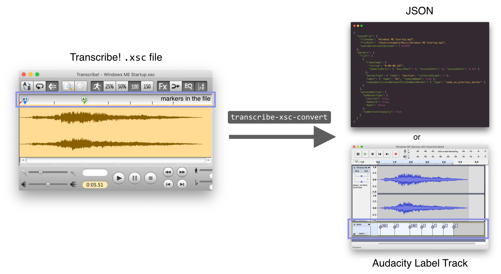

# Transcribe! `.xsc` file converter

**Get your data out of your `.xsc` files.**

[Transcribe!] v7’s proprietary `.xsc` files contain the user’s annotations of their music or audio files. This command-line tool, `transcribe-xsc-convert`, converts those `.xsc` files to a readable JSON format.

This tool’s output JSON can be processed with other tools more easily than the `.xsc` file, for purposes such as music analysis. The part of the JSON you will probably find the most useful is the timestamps of section, measure, and beat markers in the sound.

If you want to use your Transcribe! `.xsc` file’s markers in an [Audacity] project, this tool also supports exporting directly to Audacity’s Label Track format.



## Table of contents

- [Background: Transcribe! and `.xsc` files](#background-transcribe-and-xsc-files)
- [Output formats](#output-formats)
- [Example](#example)
- [Installation and usage](#installation-and-usage)
- [Tip for extracting the parts of the JSON you care about](#tip-for-extracting-the-parts-of-the-json-you-care-about)
- [For developers: running this tool from its source code](#for-developers-running-this-tool-from-its-source-code)

## Background: Transcribe! and `.xsc` files

[Transcribe!] is commercial software by Seventh String Software (not affiliated) that aids in [music transcription](<https://en.wikipedia.org/wiki/Transcription_(music)>) by letting you play and annotate audio. Transcribe!’s official description:

> The Transcribe! application is an assistant for people who want to work out a piece of music from a recording, in order to write it out, or play it themselves, or both. It doesn’t do the transcribing for you, but it is essentially a specialised player program which is optimised for the purpose of transcription. It has many transcription-specific features not found on conventional music players.

After you open a piece of music in Transcribe! and manually annotate it with markers, Transcribe! lets you save this data in an `.xsc` file. The purpose of this Transcribe! `.xsc` file converter is to get your data out of your saved `.xsc` files and into other programs.

## Output formats

This program can output an `.xsc` file’s data in either of these formats:

- generic JSON format
- Audacity Label Track format

The **generic JSON format** is not (yet) natively readable by any programs. Its goal is to be clear and well-structured enough that it will be easy for you, the user, to convert the JSON to the format you need. Here are some ideas for using the marker data within this tool’s JSON output:

- Convert the marker placements into a text file that your favorite audio editor can import, for example a [`.cue` file](<https://en.wikipedia.org/wiki/Cue_sheet_(computing)>). (The file format of the Audacity audio editor is already supported; see below.)
- Automatically create a remixed version of a track by playing only the first half of each measure.
- Automatically create a swing-time version of a track by slowing down the first half of each measure and speeding up the last half. ([`swinger.py`][swinger.py] does time-stretching like this but uses a service that tries to auto-detect where the beats are; you could adapt it to use your manually-entered beats from your `.xsc` files.)

The **Audacity Label Track format** can be used to [import](https://manual.audacityteam.org/man/importing_and_exporting_labels.html) your `.xsc` file’s marker placements as a [Label Track](https://manual.audacityteam.org/man/label_tracks.html) within the [Audacity] audio editor. Support for this format was built on top of the generic JSON format, as an example of using the JSON output of this tool to interoperate with a third-party program.

[transcribe!]: https://www.seventhstring.com/xscribe/overview.html
[swinger.py]: https://github.com/echonest/remix/blob/master/examples/swinger/swinger.py
[audacity]: https://www.audacityteam.org/

## Example

### An example `.xsc` input file

Say you have a file `Windows ME Startup.xsc` that annotates a 5.5-second sound file with markers:


### Getting generic JSON

Pass that `.xsc` file to this program with the following command in your shell:

```sh
transcribe-xsc-convert "Windows ME Startup.xsc"
```

The output will be thoroughly-labeled, easy-to-process JSON like this:

```json
{
  "soundFile": {
    "filename": "Windows ME Startup.mp3",
    "filePath": "/Users/roryokane/Music/iTunes/iTunes Music/Music/Unknown Artist/Unknown Album/Windows ME Startup.mp3",
    "audioDurationInSeconds": 5.511837
  },
  "markers": {
    "list": [
      {
        "timestamp": {
          "string": "0:00:00.167",
          "numericParts": { "hoursPart": 0, "minutesPart": 0, "secondsPart": 0.167 }
        },
        "markerType": { "name": "section", "relativeScope": 3 },
        "label": { "name": "A1", "isAutoNamed": true },
        "numSubdivisionsBetweenThisAndNextMarker": { "type": "same_as_previous_marker" }
      },
      {
        "timestamp": {
          "string": "0:00:01.039",
          "numericParts": { "hoursPart": 0, "minutesPart": 0, "secondsPart": 1.039 }
        },
        "markerType": { "name": "beat", "relativeScope": 1 },
        "label": null,
        "numSubdivisionsBetweenThisAndNextMarker": { "type": "same_as_previous_marker" }
      },
      {
        "timestamp": {
          "string": "0:00:01.961",
          "numericParts": { "hoursPart": 0, "minutesPart": 0, "secondsPart": 1.961 }
        },
        "markerType": { "name": "measure", "relativeScope": 2 },
        "label": { "name": "A2", "isAutoNamed": true },
        "numSubdivisionsBetweenThisAndNextMarker": { "type": "same_as_previous_marker" }
      },
      {
        "timestamp": {
          "string": "0:00:02.678",
          "numericParts": { "hoursPart": 0, "minutesPart": 0, "secondsPart": 2.678 }
        },
        "markerType": { "name": "beat", "relativeScope": 1 },
        "label": null,
        "numSubdivisionsBetweenThisAndNextMarker": { "type": "same_as_previous_marker" }
      },
      {
        "timestamp": {
          "string": "0:00:03.343",
          "numericParts": { "hoursPart": 0, "minutesPart": 0, "secondsPart": 3.343 }
        },
        "markerType": { "name": "beat", "relativeScope": 1 },
        "label": null,
        "numSubdivisionsBetweenThisAndNextMarker": { "type": "same_as_previous_marker" }
      },
      {
        "timestamp": {
          "string": "0:00:04.000",
          "numericParts": { "hoursPart": 0, "minutesPart": 0, "secondsPart": 4 }
        },
        "markerType": { "name": "beat", "relativeScope": 1 },
        "label": null,
        "numSubdivisionsBetweenThisAndNextMarker": { "type": "same_as_previous_marker" }
      },
      {
        "timestamp": {
          "string": "0:00:04.637",
          "numericParts": { "hoursPart": 0, "minutesPart": 0, "secondsPart": 4.637 }
        },
        "markerType": { "name": "beat", "relativeScope": 1 },
        "label": null,
        "numSubdivisionsBetweenThisAndNextMarker": { "type": "same_as_previous_marker" }
      }
    ],
    "autonumbering": {
      "byMarkerType": {
        "section": true,
        "measure": true,
        "beat": false
      },
      "numberContinuously": true
    }
  }
}
```

(The preceding example JSON has been hand-reformatted for readability and might not exactly match the structure of JSON output by the current version of the program.)

### Getting an Audacity Label Track file

With the `.xsc` file from the previous example, you can create a file `label_track.txt` in Audacity Label Track format by running this command:

```sh
transcribe-xsc-convert --format audacity_label_track "Windows ME Startup.xsc" > label_track.txt
```

Next, in Audacity, [import](https://manual.audacityteam.org/man/importing_and_exporting_labels.html) the file `label_track.txt` as a Label Track. The markers from your Transcribe! `.xsc` file will now be usable in your Audacity project:


### What this program does for you: the original `.xsc` text

`.xsc` files like `Windows ME Startup.xsc` are plain text, so you could theoretically read it directly without using this program:

```
Transcribe! for Macintosh document. Version 6089.00
Transcribe!,Macintosh OS-X,8,50,7,S,0

SectionStart,Main
SoundFileName,Windows ME Startup.mp3,MacOSX,/Users/roryokane/Music/iTunes/iTunes Music/Music/Unknown Artist/Unknown Album/Windows ME Startup.mp3
SoundFileInfo,MP3 (MPEG audio layer 3),MP3 (MPEG-1 Layer III\C Bitrate 256K),2,187294,44100,243072,5.511837
Loops,0:0,0:0,0:0,0:0,0:0,0:0,0:0,0:0,0:0,0:0
MarkerNumberContinuously,1
MarkerAutoSection,0
MarkerAutoMeasure,0
MarkerAutoBeat,1
SectionEnd,Main

SectionStart,View0
[…]
SectionEnd,View0

SectionStart,Markers
Howmany,7
S,7350,1,A1,0,0:00:00.167
B,45829,1,,0,0:00:01.039
M,86471,1,A2,0,0:00:01.961
B,118105,1,,0,0:00:02.678
B,147432,1,,0,0:00:03.343
B,176400,1,,0,0:00:04.000
B,204503,1,,0,0:00:04.637
SectionEnd,Markers

SectionStart,TextBlocks
TextBlockFont,80,12,,
Howmany,0
SectionEnd,TextBlocks

SectionStart,Loops
Howmany,20
L,1,0,0,0,,White,
L,2,0,0,0,,White,
L,3,0,0,0,,White,
[…]
L,18,0,0,0,,White,
L,19,0,0,0,,White,
L,20,0,0,0,,White,
SectionEnd,Loops
```

As the earlier JSON example hopefully demonstrates, reading this program’s JSON output with software is much easier than trying to read the `.xsc` file directly would be.

## Installation and usage

### Prerequisites

- For your computer:
  - [Node](https://nodejs.org/) and [npm](https://www.npmjs.com/get-npm) are installed.
- For you, the user:
  - You know the basics of running a program on the a command line and piping input to it.

### Installation

The [npm package][npm-package]’s name is `transcribe-xsc-file-converter`. Note that this is different from the name of the binary you run.

```sh
npm install --global transcribe-xsc-file-converter
```

[npm-package]: https://www.npmjs.com/package/transcribe-xsc-file-converter

### Usage

Basic usage:

```sh
transcribe-xsc-convert file-to-convert.xsc
```

This will convert the file contents to a generic JSON format and print that JSON to stdout. `file-to-convert.xsc` should be the path to your own `.xsc` file.

To see all supported arguments:

```
transcribe-xsc-convert --help
```

## Tip for extracting the parts of the JSON you care about

The output JSON is verbose and somewhat redundant on purpose, for the sake of being easy to interpret without having to consult a separate documentation file. If you want to slim the resulting JSON down to only the fields you care about, you can pass the JSON through the [`jq`][jq] tool.

For example, to get only the timestamp string and the label string of each marker in the file:

```sh
cat convertedTranscribeFile.json | jq '[{timestamp: .markers.list[].timestamp.string, label: .markers.list[].label.name}]'
```

Example output:

```json
[
  {
    "timestamp": "0:00:00.167",
    "label": "A1"
  },
  {
    "timestamp": "0:00:01.039",
    "label": null
  },
  …
  {
    "timestamp": "0:00:04.637",
    "label": null
  }
]
```

The interactive tool at https://jqplay.org/ can help you experiment with `jq` filters.

[jq]: https://stedolan.github.io/jq/

## For developers: running this tool from its source code

### Installation from source code

Set up your environment like any other Git repo containing an npm package:

1. Download the code onto your computer, e.g. with `git clone`.
1. `cd` into the directory of this source code.
1. Run `npm install` (or `yarn` if you prefer) to install required dependencies.

### Running from source code

```sh
npm start file-to-convert.xsc
```

`file-to-convert.xsc` should be the path to your own `.xsc` file. If you prefer Yarn, use`yarn start file-to-convert.xsc` instead.

See the `scripts` key in `package.json` for other scripts you can run.
