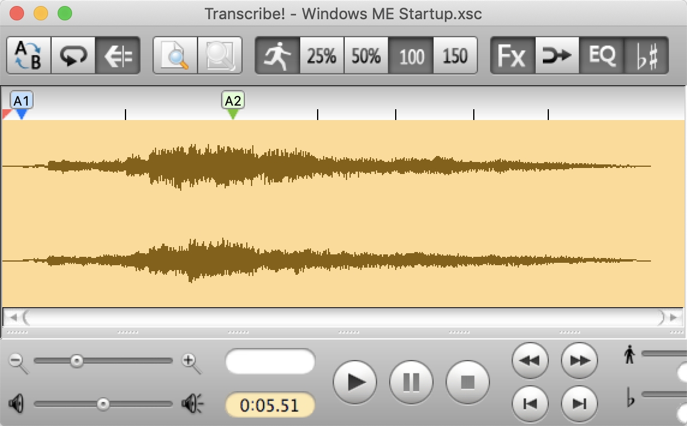

# Transcribe! `.xsc` file converter

Converts [Transcribe!] v7’s proprietary `.xsc` files, which contain annotations of music, to a readable JSON format. That JSON can then be more easily processed with other tools for various audio/music applications – especially the data about section, measure, and beat markers in the sound file. Some ideas for using the marker data exposed by this tool:

- Convert the marker placements into a text file that the [Audacity](https://www.audacityteam.org/) audio editor can [import](https://manual.audacityteam.org/man/importing_and_exporting_labels.html) as a [Label Track](https://manual.audacityteam.org/man/label_tracks.html).
- Automatically create a remixed version of a track by playing only the first half of each measure.
- Automatically create a swing-time version of a track by slowing down the first half of each measure and speeding up the last half. (like `swinger.py`, but with your manually-entered beats instead of the tool’s guesses at where the beats are.)

There are not yet any programs that can natively understand the JSON data output by this program. The goal of the JSON output is to be clear and well-structured enough that it will be easy for you, the user, to convert the JSON to the format you need.

[transcribe!]: https://www.seventhstring.com/xscribe/overview.html
[swinger.py]: https://github.com/echonest/remix/blob/master/examples/swinger/swinger.py

## Installation and usage

Prerequisites:

- You know the basics of running a program on the a command line and piping input to it.
- [Node](https://nodejs.org/) and [npm](https://www.npmjs.com/) are installed.
- You are okay with receiving JSON as the output of this tool; you can massage the JSON into the format you need.

Installation:

1. Download the code onto your computer (I haven’t published this as a package yet). You can do this by cloning this repository with `git` or downloading its contents as a zip file with GitHub.
1. `cd` into the directory of this source code.
1. Run `npm install`, or `yarn` if you prefer [Yarn](https://yarnpkg.com/) to npm, to install required dependencies.

Running:

1. Run `npx ts-node index.ts`, or `yarn run ts-node index.ts` if you use Yarn. So far this command only converts a test file in a known place – accepting the file as input will come later.

## Example

Say you have a file `Windows ME Startup.xsc` that annotates a 5.5-second sound file with markers:



If you opened that `.xsc` file with a text editor, you would see that it contains text whose meaning can be guessed at but not fully understood:

```
Transcribe! for Macintosh document. Version 6089.00
Transcribe!,Macintosh OS-X,8,50,7,S,0

SectionStart,Main
SoundFileName,Windows ME Startup.mp3,MacOSX,/Users/roryokane/Music/iTunes/iTunes Music/Music/Unknown Artist/Unknown Album/Windows ME Startup.mp3
SoundFileInfo,MP3 (MPEG audio layer 3),MP3 (MPEG-1 Layer III\C Bitrate 256K),2,187294,44100,243072,5.511837
Loops,0:0,0:0,0:0,0:0,0:0,0:0,0:0,0:0,0:0,0:0
MarkerNumberContinuously,1
MarkerAutoSection,0
MarkerAutoMeasure,0
MarkerAutoBeat,1
SectionEnd,Main

SectionStart,View0
[…]
SectionEnd,View0

SectionStart,Markers
Howmany,7
S,7350,1,A1,0,0:00:00.167
B,45829,1,,0,0:00:01.039
M,86471,1,A2,0,0:00:01.961
B,118105,1,,0,0:00:02.678
B,147432,1,,0,0:00:03.343
B,176400,1,,0,0:00:04.000
B,204503,1,,0,0:00:04.637
SectionEnd,Markers

SectionStart,TextBlocks
TextBlockFont,80,12,,
Howmany,0
SectionEnd,TextBlocks

SectionStart,Loops
Howmany,20
L,1,0,0,0,,White,
L,2,0,0,0,,White,
L,3,0,0,0,,White,
[…]
L,18,0,0,0,,White,
L,19,0,0,0,,White,
L,20,0,0,0,,White,
SectionEnd,Loops
```

If you pass that `.xsc` file to this program, this program will output this thoroughly-labeled, easy-to-process JSON <sub>(output from the latest version may be different)</sub>:

```json
{
  "soundFile": {
    "filename": "Windows ME Startup.mp3",
    "filePath": "/Users/roryokane/Music/iTunes/iTunes Music/Music/Unknown Artist/Unknown Album/Windows ME Startup.mp3",
    "audioDurationInSeconds": "5.511837"
  },
  "markers": {
    "list": [
      {
        "timestamp": {
          "string": "0:00:00.167",
          "hours": 0,
          "minutes": 0,
          "seconds": 0.167
        },
        "markerType": {
          "name": "section",
          "relativeScope": 3
        },
        "label": "A1",
        "numSubdivisionsBetweenThisAndNextMarker": {
          "type": "same_as_previous_marker"
        }
      },
      {
        "timestamp": {
          "string": "0:00:01.039",
          "hours": 0,
          "minutes": 0,
          "seconds": 1.039
        },
        "markerType": {
          "name": "beat",
          "relativeScope": 1
        },
        "label": null,
        "numSubdivisionsBetweenThisAndNextMarker": {
          "type": "same_as_previous_marker"
        }
      },
      {
        "timestamp": {
          "string": "0:00:01.961",
          "hours": 0,
          "minutes": 0,
          "seconds": 1.961
        },
        "markerType": {
          "name": "measure",
          "relativeScope": 2
        },
        "label": "A2",
        "numSubdivisionsBetweenThisAndNextMarker": {
          "type": "same_as_previous_marker"
        }
      },
      {
        "timestamp": {
          "string": "0:00:02.678",
          "hours": 0,
          "minutes": 0,
          "seconds": 2.678
        },
        "markerType": {
          "name": "beat",
          "relativeScope": 1
        },
        "label": null,
        "numSubdivisionsBetweenThisAndNextMarker": {
          "type": "same_as_previous_marker"
        }
      },
      {
        "timestamp": {
          "string": "0:00:03.343",
          "hours": 0,
          "minutes": 0,
          "seconds": 3.343
        },
        "markerType": {
          "name": "beat",
          "relativeScope": 1
        },
        "label": null,
        "numSubdivisionsBetweenThisAndNextMarker": {
          "type": "same_as_previous_marker"
        }
      },
      {
        "timestamp": {
          "string": "0:00:04.000",
          "hours": 0,
          "minutes": 0,
          "seconds": 4
        },
        "markerType": {
          "name": "beat",
          "relativeScope": 1
        },
        "label": null,
        "numSubdivisionsBetweenThisAndNextMarker": {
          "type": "same_as_previous_marker"
        }
      },
      {
        "timestamp": {
          "string": "0:00:04.637",
          "hours": 0,
          "minutes": 0,
          "seconds": 4.637
        },
        "markerType": {
          "name": "beat",
          "relativeScope": 1
        },
        "label": null,
        "numSubdivisionsBetweenThisAndNextMarker": {
          "type": "same_as_previous_marker"
        }
      }
    ],
    "autonumbering": {
      "numberContinuously": true,
      "autoSectionBool": false
    }
  }
}
```

## Extracting the parts of the output you care about

The output JSON is verbose and somewhat redundant on purpose, for the sake of being easy to interpret without having to consult a separate documentation file. If you want to slim the resulting JSON down to only the fields you care about, you can pass the JSON through the [`jq`][jq] tool.

For example, to get only the timestamp string and the label string of each marker in the file:

```sh
cat convertedTranscribeFile.json | jq '[{timestamp: .markers.list[].timestamp.string, label: .markers.list[].label}]'
```

Example output:

```json
[
  {
    "timestamp": "0:00:00.167",
    "label": "A1"
  },
  {
    "timestamp": "0:00:01.039",
    "label": null
  },
  …
  {
    "timestamp": "0:00:04.637",
    "label": null
  }
]
```

The interactive tool at https://jqplay.org/ can help you experiment with `jq` filters.

[jq]: https://stedolan.github.io/jq/
